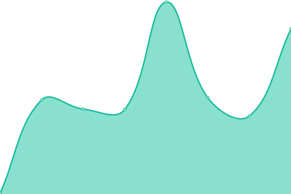
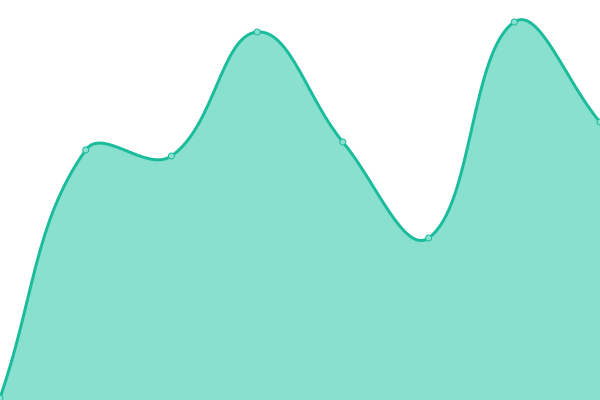

# 

**BuyProperly** (https://buyproperly.ca) _lets you invest in real estate to grow and diversify your wealth without traditional upfront costs_. **Starting at $2500**, our AI-powered platform helps you achieve above-human performance earning monthly rental income, as well as capital appreciation.

<!--start: status pages-->
<!-- This summary is generated by Upptime (https://github.com/upptime/upptime) -->
<!-- Do not edit this manually, your changes will be overwritten -->
<!-- prettier-ignore -->
| URL | Status | History | Response Time | Uptime |
| --- | ------ | ------- | ------------- | ------ |
|  [BuyProperly App](https://www.buyproperly.ca) | 🟩 Up | [buy-properly-app.yml](https://github.com/BuyProperly/status/commits/HEAD/history/buy-properly-app.yml) | 

 592ms
     
 | 

<a href="https://status.buyproperly.ca/history/buy-properly-app">100.00%</a>
    

|  BuyProperly Server | 🟥 Down | [buy-properly-server.yml](https://github.com/BuyProperly/status/commits/HEAD/history/buy-properly-server.yml) | 

 67ms
     
 | 

<a href="https://status.buyproperly.ca/history/buy-properly-server">0.03%</a>
    

<!--end: status pages-->

 

  

  <a href="https://buyproperly.ca/">Real Estate investing made for you. Starting at $2500 →</a>

