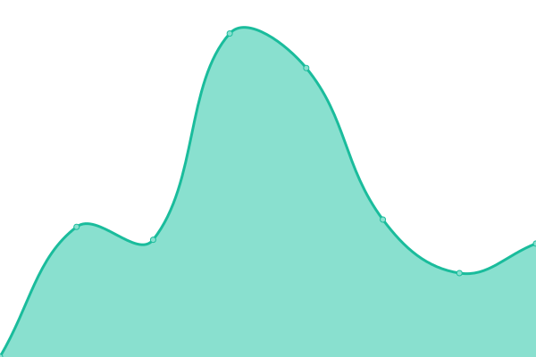
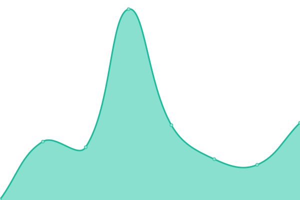
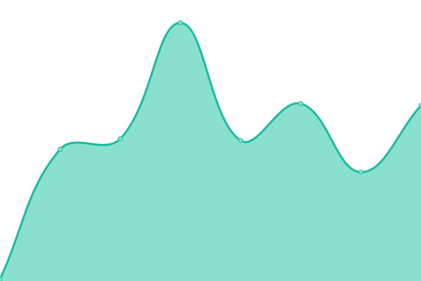
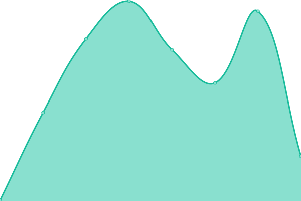

# 

**BuyProperly** (https://buyproperly.ai) _lets you access high-yield alternative investment opportunities in real estate, private credit, private equity, hedge funds, and venture capital at BuyProperly. Start with just $2,500._. **Starting at $2500**, our AI-powered platform helps you achieve above-human performance earning monthly rental income, as well as capital appreciation.

<!--start: status pages-->
<!-- This summary is generated by Upptime (https://github.com/upptime/upptime) -->
<!-- Do not edit this manually, your changes will be overwritten -->
<!-- prettier-ignore -->
| URL | Status | History | Response Time | Uptime |
| --- | ------ | ------- | ------------- | ------ |
|  [BuyProperly AI](https://www.buyproperly.ai) | 🟩 Up | [buy-properly-ai.yml](https://github.com/BuyProperly/status/commits/HEAD/history/buy-properly-ai.yml) | 

 540ms
     
 | 

<a href="https://status.buyproperly.ai/history/buy-properly-ai">100.00%</a>
    

|  [BuyProperly Canada](https://www.buyproperly.ai/ca) | 🟩 Up | [buy-properly-canada.yml](https://github.com/BuyProperly/status/commits/HEAD/history/buy-properly-canada.yml) | 

 140ms
     
 | 

<a href="https://status.buyproperly.ai/history/buy-properly-canada">100.00%</a>
    

|  [BuyProperly USA](https://www.buyproperly.ai/us) | 🟩 Up | [buy-properly-usa.yml](https://github.com/BuyProperly/status/commits/HEAD/history/buy-properly-usa.yml) | 

 78ms
     
 | 

<a href="https://status.buyproperly.ai/history/buy-properly-usa">100.00%</a>
    

|  [BuyProperly App Canada](https://app.buyproperly.ca/api/examples) | 🟩 Up | [buy-properly-app-canada.yml](https://github.com/BuyProperly/status/commits/HEAD/history/buy-properly-app-canada.yml) | 

 221ms
     
 | 

<a href="https://status.buyproperly.ai/history/buy-properly-app-canada">100.00%</a>
    

|  [BuyProperly App USA](https://app.buyproperly.com) | 🟩 Up | [buy-properly-app-usa.yml](https://github.com/BuyProperly/status/commits/HEAD/history/buy-properly-app-usa.yml) | 

 188ms
     
 | 

<a href="https://status.buyproperly.ai/history/buy-properly-app-usa">100.00%</a>
    

|  [BuyProperly Blog](https://buyproperly.ai/blog/) | 🟩 Up | [buy-properly-blog.yml](https://github.com/BuyProperly/status/commits/HEAD/history/buy-properly-blog.yml) | 

 74ms
     
 | 

<a href="https://status.buyproperly.ai/history/buy-properly-blog">100.00%</a>
    

<!--end: status pages-->
